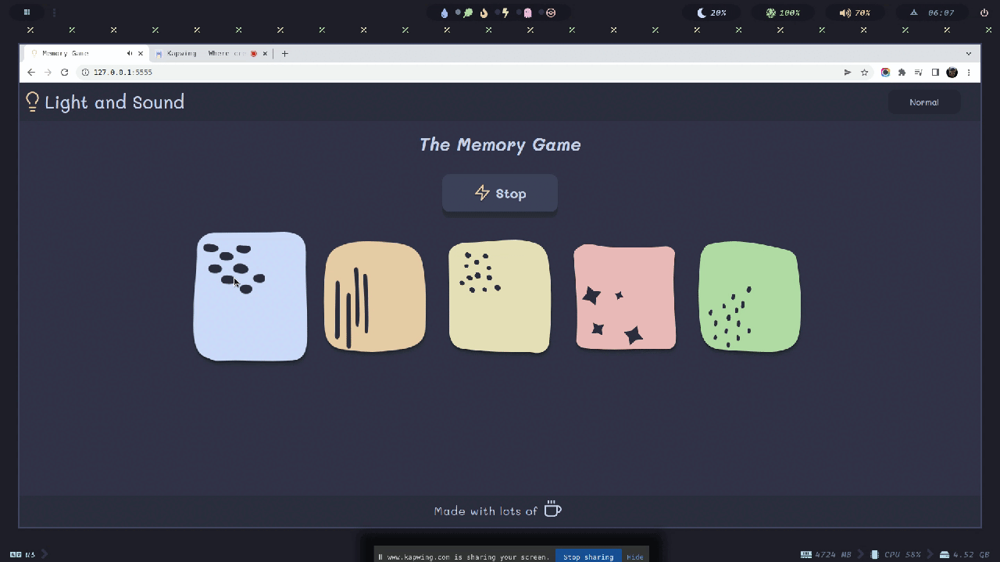

# Pre-work - *Memory Game*

**Memory Game** is a Light & Sound Memory game to apply for CodePath's SITE Program. 

Submitted by: **Angel García (Detective Pikachu)**

Time spent: **14** hours spent in total

Link to project: https://glitch.com/edit/#!/memory-app-game-thing

## Required Functionality

The following **required** functionality is complete:

* [x] Game interface has a heading (h1 tag), a line of body text (p tag), and four buttons that match the demo app
* [x] "Start" button toggles between "Start" and "Stop" when clicked. 
* [x] Game buttons each light up and play a sound when clicked. 
* [x] Computer plays back sequence of clues including sound and visual cue for each button
* [x] Play progresses to the next turn (the user gets the next step in the pattern) after a correct guess. 
* [x] User wins the game after guessing a complete pattern
* [x] User loses the game after an incorrect guess

The following **optional** features are implemented:

* [x] Any HTML page elements (including game buttons) has been styled differently than in the tutorial
* [x] Buttons use a pitch (frequency) other than the ones in the tutorial
* [x] More than 4 functional game buttons
* [ ] Playback speeds up on each turn
* [x] Computer picks a different pattern each time the game is played
* [x] Player only loses after 3 mistakes (instead of on the first mistake)
* [x] Game button appearance change goes beyond color (e.g. add an image)
* [ ] Game button sound is more complex than a single tone (e.g. an audio file, a chord, a sequence of multiple tones)
* [ ] User has a limited amount of time to enter their guess on each turn

The following **additional** features are implemented:

- [ ] List anything else that you can get done to improve the app!

## Video Walkthrough (GIF)

If you recorded multiple GIFs for all the implemented features, you can add them here:

### Preview

### Win

### Lose

### Stop Game

### Change Difficulty

## Reflection Questions
1. If you used any outside resources to help complete your submission (websites, books, people, etc) list them here. 

        Most of the sources I used as referece where mostly for CSS styling, and design planning.

        * Shadows
            https://stackoverflow.com/questions/6088409/svg-drop-shadow-using-css3

        * Google Font
            https://fonts.google.com/specimen/Mali?query=Mali#standard-styles

        * Minor Bug where dragging caused a button to register a pressed despite the mouse leaving the area where such button is.
            https://www.codegrepper.com/code-examples/css/css+disable+image+drag

        * 3D Button animation, as well as some css/html practices
            https://www.joshwcomeau.com

        * Figma Design
            https://www.figma.com/file/O27Ohl2beM1OmVWj20oZpV/Memory-Concept-Figma?node-id=0%3A1
        
        * Word Counter
            https://wordcounter.net/

        * CSS Tricks guide for Flexbox
            https://css-tricks.com/snippets/css/a-guide-to-flexbox/

        * A very detailed response of looping over a collection of html elements (like children of a div)
            https://stackoverflow.com/questions/22754315/for-loop-for-htmlcollection-elements

        * MDN Documentation
            https://developer.mozilla.org/en-US/docs/Web
            
        * Kapwing (Video Editing, GIF editing)
            https://www.kapwing.com

2. What was a challenge you encountered in creating this submission (be specific)? How did you overcome it? (recommended 200 - 400 words) 

One of the challenges I encountered was fixing certain bugs that broke the synchronization between the player repeating the sequence, and the game showing the clues. Sometimes the clues started before the player finished to complete the sequence, or the `guessCounter` not working properly and causing a shift between which tone to be played first (ie, in a sequence [1, 4, 3, 2], instead of starting to check for the first index, it checked on the 2nd, and if asserted there, it will shift again). The dev tools that firefox offers really helped me on nailing the problem was that `guessCounter` was not resseting back to 0 on a fully succesful round. It is this very tool that also aid me on debugging styles over different screen sizes, or odd style behaviour like a transition animation not working on the play button or the color blocks. Another great aid for me was CSS-tricks and the MDN Documentation, both for Javascript problems and CSS problems. Speaking of CSS, John Comeau's detailed styling tutorials also helped me a lot on understanding some psedo-classes.

3. What questions about web development do you have after completing your submission? (recommended 100 - 300 words) 

I would ask about best practices on asyncronous functions. One thing I noted was how `setTimeout` was used to delay the start and end time of a single tone, and further expanded into a sequence of notes. In the project, I borrowed a bit from the music functions to fix some minor bugs I found along the way, such as the player being able to interact with a button when the clues are playing. I Would ask about how we can use async functions send a custom notification where the player gets a victory or fail card instead of the alert function used; how can we apply this when building an API with an ORM (namely prisma, whose examples and YT video tutorials use ayncronous functions). In Programming Languages, my professor gave students a brief explanation of concurrency with Golang. Although we saw how it works in action, the professor never explain when and how would be a proper save way to release or set the lock, and well, end in a deadlock. One thing that my other professor of Introduction of Software Enginneering repeated to us students was the posibility of a deadlock occuring in unpredictable ways, on cases that was not considered in the domain. How can I be sure that a notification, or an API won't end in a deadlock?

4. If you had a few more hours to work on this project, what would you spend them doing (for example: refactoring certain functions, adding additional features, etc). Be specific. (recommended 100 - 300 words) 

I would do start working on the optional features I couldn't work on, such as the time limit and the speed of the game for each turn. The current sound is not very pleasing if pressed for more than 2 seconds, it somewhat dizzy me a bit. With maybe an hour or two to familiarize more with the sound API and about 30 minutes between implementation and testing, I would work on a more chiptune sound for each block. After being able to have a sound I'm statisfied with, I would then use that to create a simple victory and fail music. Another implementation I would work on is on a better difficulty setting. The current form is hardcoded on the length of the block order sequence required to win the game. Adding the a speed factor which decreases the duration of a tone and the delay after the next tone before reaching a threshold. For the timer, I was able to have a glimpse over the documentation, and using a `setInterval` function I could start counting. Since this function increases a unit every time is called, i would use the `setTimeout` function to make sure it counts for every second that passes. The value could be hardcoded so count about 4 to 5 seconds before reaching a strike This will make the game much more challenging!

## Interview Recording URL Link

[My 5-minute Interview Recording](https://www.kapwing.com/videos/623fc6670f77e600a0a84665)

## License

    Copyright Angel L García

    Licensed under the Apache License, Version 2.0 (the "License");
    you may not use this file except in compliance with the License.
    You may obtain a copy of the License at

        http://www.apache.org/licenses/LICENSE-2.0

    Unless required by applicable law or agreed to in writing, software
    distributed under the License is distributed on an "AS IS" BASIS,
    WITHOUT WARRANTIES OR CONDITIONS OF ANY KIND, either express or implied.
    See the License for the specific language governing permissions and
    limitations under the License.
